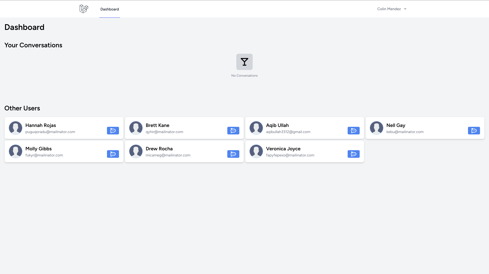
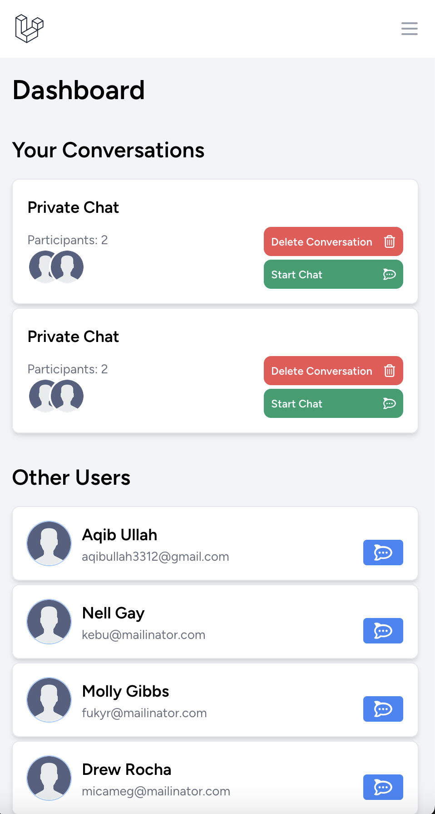
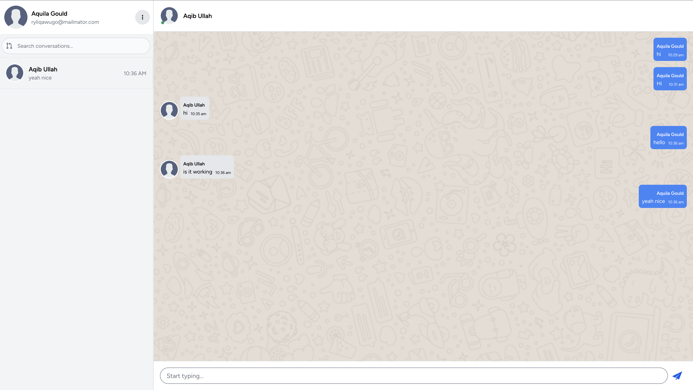
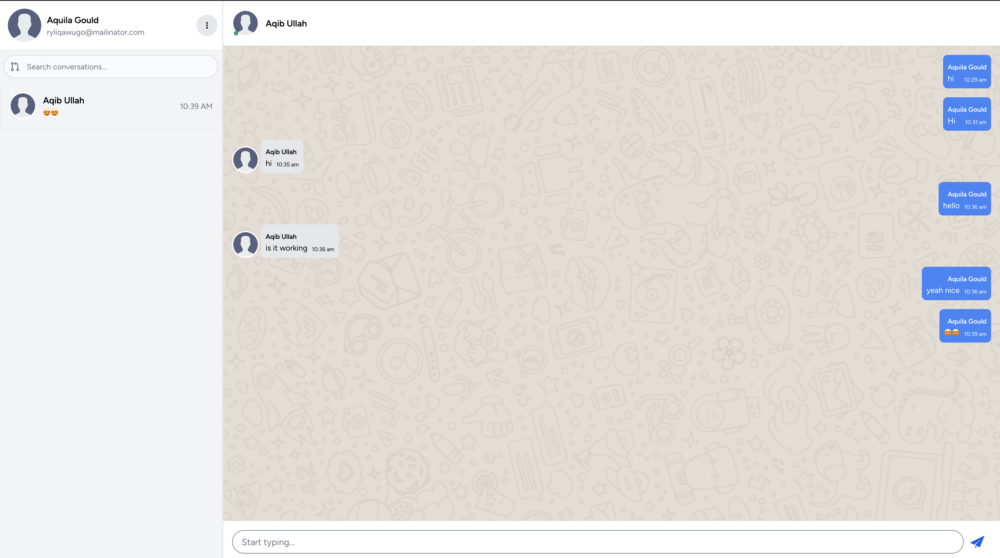
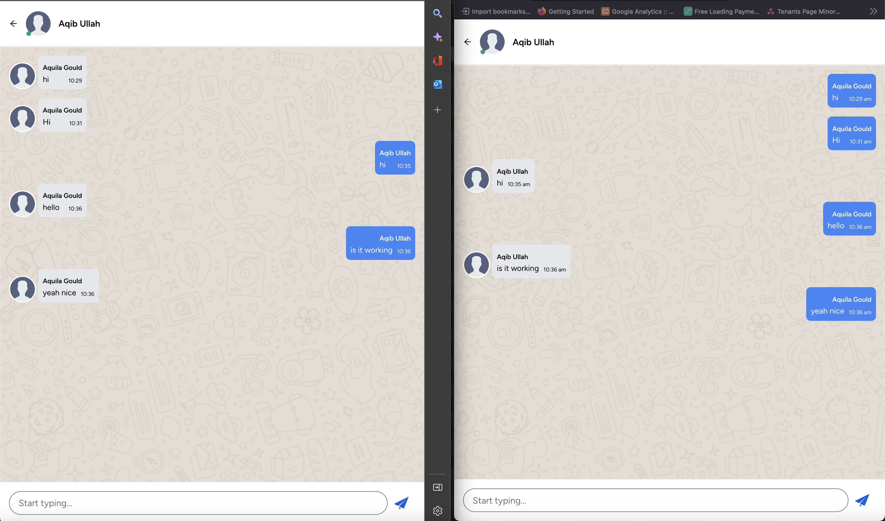

# Laravel Chat Application

### 1. Home Chat


### 2. Home Chat Mobile


### 3. Chat Desktop


### 4. Chat Desktop


### 5. Chat Desktop



## Table of Contents
- [Introduction](#introduction)
- [Features](#features)
- [Installation](#installation)
- [Configuration](#configuration)
- [Usage](#usage)
- [Screenshots](#screenshots)
- [Technologies Used](#technologies-used)
- [License](#license)

## Introduction
The Laravel Chat Application is a real-time chat application built with Laravel, Vue.js, and Pusher for real-time message broadcasting. This app is designed for seamless communication, mimicking familiar chat interfaces, with features like online status, message notifications, and group chats.

## Features
- Real-time messaging with Pusher
- Private and group chat functionality
- Online/offline user status
- Notification system for new messages
- Typing indicators
- Responsive design
- desktop layout
- mobile layout

## Installation

### Prerequisites
- PHP 8.x
- Composer
- Node.js and npm
- MySQL or any other compatible database
- Pusher account (for real-time events) OR Laravel reverb
- for Laravel reverb you need to comment pusher code in app.js file and uncomment the reverb code

### Steps

1. **Clone the repository**
   ```bash
   git clone https://github.com/username/repository.git
   cd repository

2. **Install Dependencies**
    ```bash
    composer install

3. ** Install Node Dependencies**
    ```bash
    npm install
    npm run build 
   ---OR--- 
   npm run dev for local
